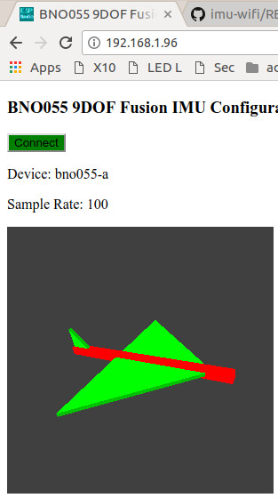

# WiFi IMU to 3D display



This project is a wireless variation on the MPU6050 DMP Teapot demo. See the
following links for more details.

https://github.com/jrowberg/i2cdevlib/tree/master/Arduino/MPU6050/examples/MPU6050_DMP6
http://www.geekmomprojects.com/mpu-6050-dmp-data-from-i2cdevlib/

The differences are 1) the BNO055 is used instead of the MPU6050 and 2) the
Arduino AVR board is replaced with an ESP8266 WiFi board running on battery so
the IMU is tether free.

Two different methods are covered. The first uses a program running on the
ESP8266 that sends IMU quaternion data in Open Sound Control (OSC) messages
over UDP WiFi. The messages are received on a computer running Processing that
renders a 3D airplane.

The second uses a program running on the ESP8266 that is an HTTP server and web
socket server. When an HTTP client connects, the initial web page includes a
[p5.js](https://p5js.org/) program which renders a 3D airplane. The ESP8266
sends Euler angles over the web socket to the client. The advantages with this
method are 1) more than one client can be connected at the same time, and 2) no
software is installed on the clients. The client can be any browser with WebGL
running on any OS including IOS, Android, Win, Mac, and Linux. The ESP8266
supports web sockets so node.js and socket.io are not used.

The disadvantage is quaterion support is not available on p5.js so full 360
degree rotations do not work.

## Hardware

* Adafruit Huzzah ESP8266 Feather with battery
* Adafruit BNO055 9DOF Fusion IMU breakout board

## IMU to Processing using OSC messages

### Arduino sketch for ESP8266

The ESP8266 sketch sends quaternion orientation data from the BNO055 using Open
Sound Control (OSC) over UDP WiFi. IMU calibration is supported. The web user
interface is still TBD and uses web sockets but IMU data is not sent via web
sockets.

IMU calibration is supported but it requires monitoring console output. In the
future, calibration will be control via the web user interface.

```
imuosc/imuosc.ino               // Main program
       bno055_calibrate.h       // Calibration functions
       bno055_calibrate.ino
       index_html.h             // index.html stored in array of char
       sketch_js.h              // javascript stored in array of char
```

### Processing Teapot sketch (actually an airplane)

This program is a modified version of the MPUTeapot.pde demo included with the
[i2cdevlib](https://www.i2cdevlib.com/) project. The serial port code has been
replaced with OSC over UDP WiFi. Although it was designed to work with the
MPU6050 IMU, it works with quaternion data from any IMU. The sketch was tested
using [Processing 3.3.5](https://processing.org).

`osc3d/osc3d.pde                 // Main program`

## IMU to p5.js over web sockets

The main program consists of the HTTP server and web socket server. In addition
program collects Euler angles from the BNO055 IMU then sends the angles over a
web socket to the HTTP client. The p5.js sketch in sketch_js.h runs on the
browser and shows the 3D airplane.

IMU calibration is supported but it requires monitoring console output. In the
future, calibration will be control via the web user interface.

```
imup5/imup5.ino                 // Main program
      bno055_calibrate.h        // Calibration functions
      bno055_calibrate.ino
      index_html.h              // index.html stored in array of char
      sketch_js.h               // javascript stored in array of char
```

